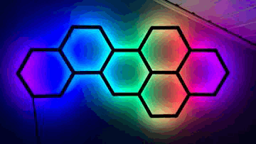
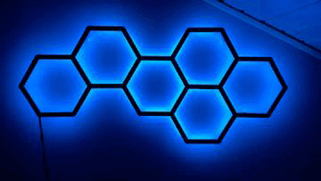
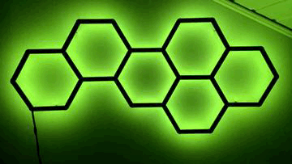
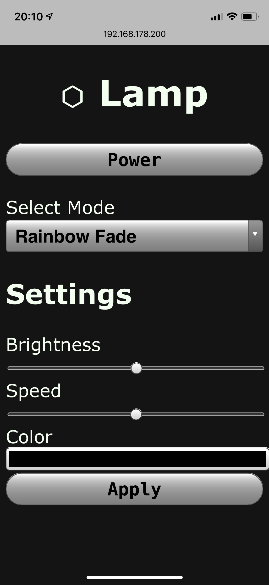

# HexLamp
This GIT repo contains the software for controlling led lamp.
The lamp is using WS2812b neopixels.
You can find the lamp this software was designd for on [Thinkiverse](https://www.thingiverse.com/thing:4759920 "HexLamp").

## Conntent
1. [Functionality](##functionality "Functionality")
2. [Hardware](##hardware "Hardware")
3. [Setup and installation](##setup-and-installation "Setup and installation")

## Funtionality
This section documents the functionality of the individual software parts.
The software consists of three main parts:
1. Lamp control
2. Web GUI
3. Tooling

### Lamp control
This part of the software is controlling the neopixels.
The lamp can be used in diffrent amnimation modes.
The curent supported modes are:
* rainbow fade
* monochrome fade
* single color
* warm white
* random color fade

### Web GUI
The web GUI is used as a userinterface.
For this the microcontroller is connected to a local WiFi network and is hosting a webserver.
This webserver can be accessed be other devices connected to the same network by entering the IP address of the arduino into a webbrowser.
Using the GUI it is possible to switch the lamp on and off and setting up the diffrent modes.

### Tooling
The Arduino uses C / C ++ code to create the website to control the lamp. It is done by sending HTML code using a couple of println functions. Since the HTML code is handled as strings inside the arduino code it would be difficult to build the website directly in there. There is now syntax check or other toolös to make coding more easy. Therefore I decided to write the code for the GUI in a separate HTML file. To convert this code into something the arduino can use i wrote a short python sript to cinvert this code into a couple of println commands which are stored in a seperat file and can be just copyied into the programm.

## Hardware
The code is writen and tested for an [Arduino Nano 33 IoT](https://store.arduino.cc/arduino-nano-33-iot "store.arduino.cc"). This microcontroller has a own WiFI antenna and therefore no extension board was needed.

## Setup and installation
In order to use this software with your local network it is necessary to make some configurations before downloading the software on to the arduino. Use the file config.h to do this. First of all you have to enter the name and password of the WiFi network you want to connect to. It is also possible to enter a static IP addresse. You can also configure a static ip address. If the ip address is set to 0.0.0.0 the arduino will be connected using DHCP.

    #define SECRET_SSID "WiFI_NAME"
    #define SECRET_PASS "PASSWORT"
    const IPAddress IP(0, 0, 0, 0);